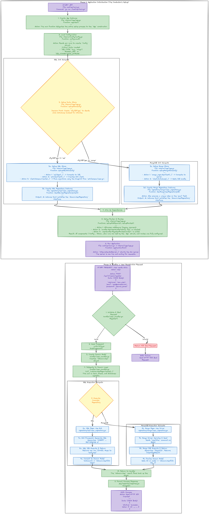

# Advanced Go API Template

[](https://golang.org/)
[]()

This repository serves as a production-ready template for building robust, scalable, and maintainable web services in Go. It is built upon a foundation of Clean Architecture principles, ensuring a clear separation of concerns and making the codebase easy to test, extend, and reason about.

It comes pre-configured with a suite of best-practice tools and features, allowing you to focus on writing business logic instead of boilerplate code.

---

## ✨ Key Features

*   **Clean Architecture:** A clear separation between domain logic, data persistence, and API delivery layers.
*   **Dual Database Support:** Easily switch between SQL and MongoDB backends.
    *   **SQL:** Uses **[Ent](https://entgo.io/)** for type-safe, auto-generated, and graph-based ORM.
    *   **MongoDB:** Native driver implementation for high performance.
*   **Configuration Management:** Centralized, environment-aware configuration loaded from environment variables with sensible defaults.
*   **Structured Logging:** Powerful structured logging with **[Logrus](https://github.com/sirupsen/logrus)**, configurable for JSON or console output.
*   **Robust Middleware:** Includes pre-built middleware for request logging, panic recovery, and authentication.
*   **Authentication:** JWT-based authentication for securing endpoints.
*   **Standardized Responses:** A `pkg/response` utility for consistent JSON success and error responses.
*   **Comprehensive Testing:** A full suite of tests, including:
    *   Unit tests for individual components.
    *   **Full integration tests** that run against real PostgreSQL, MySQL, and MongoDB databases.
*   **Containerized Development:** `docker-compose.yml` to spin up a complete development database environment (Postgres, MySQL, Mongo) with a single command.
*   **Developer Tooling:** A `Makefile` with convenient commands for common tasks like building, testing, running, and code generation.

---

## 🏗️ Architectural Overview

This project is built using **Clean Architecture** principles to create a decoupled, testable, and maintainable system. The diagram below illustrates the component layers and the flow of data from an incoming request to the final response.



### Data & Dependency Flow Breakdown

1.  **Entry Point (`cmd/api/main.go`):** The application starts here. Its only job is to initialize and run the core application logic from `internal/app`.
2.  **Composition Root (`internal/app/app.go`):** This is the "glue" of the application. It reads configuration, sets up the logger, initializes the database connection (`repository`), and injects these dependencies into the `handler` layer. It also sets up the Gin router, middleware, and routes.
3.  **HTTP Request:** An incoming request first hits the **Gin Router**.
4.  **Middleware (`internal/middleware`):** The request passes through the configured middleware (e.g., Logging, Panic Recovery, Authentication) before reaching the designated handler.
5.  **Handler (`internal/handler`):** The handler is responsible for the API layer. It parses and validates the request body, calls the appropriate methods on the repository (via an interface), and uses the `pkg/response` utility to format the JSON response. **It knows nothing about the database; it only knows about the `domain` interface it depends on.**
6.  **Repository (`internal/repository`):** This is the infrastructure layer. It provides the concrete implementation of the `domain`'s repository interface. It contains all the logic for communicating with the database, whether it's building a query with Ent (for SQL) or using the Mongo driver.
7.  **Domain (`internal/domain`):** This is the heart of the application. It contains the core business logic, entities (e.g., `User` struct), and repository interfaces. **This layer has zero dependencies on any other part of the application (like Gin or Ent).**

### Architectural Principles

*   **The Dependency Rule:** Dependencies only point inwards. The `handler` and `repository` layers depend on the `domain` layer, but the `domain` layer depends on nothing. This ensures that the core business logic is independent of infrastructure details like the database or web framework.
*   **Dependency Inversion:** Instead of high-level components (handlers) depending on low-level components (repositories), both depend on abstractions (interfaces defined in `domain`). This allows us to easily swap out the database implementation (from SQL to Mongo) without changing a single line of code in the handler.

---

## 📁 Directory Structure

```
.
├── cmd/api/main.go         # Main application entry point.
├── docker-compose.yml      # Docker configuration for development databases.
├── images/architecture.png  
├── internal                # All private application logic.
│   ├── app                 # Core application setup and composition root.
│   ├── auth                # JWT generation/validation and password hashing.
│   ├── config              # Configuration loading and management.
│   ├── domain              # Core business models and repository interfaces.
│   ├── ent                 # Ent (SQL ORM) auto-generated code and schema.
│   ├── handler             # HTTP handlers (controllers).
│   ├── middleware          # Gin middleware (logging, recovery, auth).
│   └── repository          # Data access layer implementations.
│       ├── mongo           # MongoDB repository implementation.
│       └── sql             # SQL (Ent) repository implementation.
├── pkg                     # Shared, reusable packages.
│   ├── logger              # Structured logger wrapper.
│   └── response            # Standardized JSON response utility.
├── tests                   # Unit and integration tests.
├── .gitignore              # Standard Go .gitignore.
└── Makefile                # Commands for development tasks.
```

---

## 🚀 Getting Started

### Prerequisites

*   [Go](https://golang.org/doc/install) (version 1.18 or newer)
*   [Docker](https://www.docker.com/products/docker-desktop/) & Docker Compose
*   [Make](https://www.gnu.org/software/make/) (optional, but recommended for using the Makefile commands)

### 1. Set Up the Environment

First, clone the repository:
```bash
git clone https://github.com/your-username/your-repo.git
cd your-repo
```

### 2. Start Development Databases

This template includes a `docker-compose.yml` file to easily run PostgreSQL, MySQL, and MongoDB for development and testing.

```bash
docker-compose up -d
```

This command will start all three databases in the background. You can start a specific one if you prefer (e.g., `docker-compose up -d postgres`).

### 3. Generate Ent Code (for SQL)

If you plan to use an SQL database, you must first generate the type-safe ORM code from your schema.

```bash
make ent-generate
```
This command reads the schema from `internal/ent/schema` and generates the necessary Go code in `internal/ent`.

### 4. Run the Application

You can now run the application. It will use an in-memory SQLite database by default.

```bash
make dev
```
The server will start on `http://localhost:8080`.

To run a compiled binary instead:
```bash
make run
```

---

## ⚙️ Configuration

The application is configured using environment variables. You can set them directly in your shell or create a `.env` file in the root directory.

| Environment Variable     | Description                                                                  | Default Value                                    |
| ------------------------ | ---------------------------------------------------------------------------- | ------------------------------------------------ |
| `APP_ENV`                | Application environment. Affects Gin mode. (`debug`, `release`, `test`)        | `debug`                                          |
| `PORT`                   | The port for the HTTP server to listen on.                                   | `8080`                                           |
| `LOG_LEVEL`              | The minimum log level to output. (`debug`, `info`, `warn`, `error`)            | `info`                                           |
| `JWT_SECRET`             | The secret key used to sign and validate JWTs. **Change this in production!**  | `default-secret`                                 |
| `DB_TYPE`                | The database backend to use. (`sql` or `mongo`)                              | `sql`                                            |
| `DB_DRIVER`              | The SQL driver to use (when `DB_TYPE=sql`). (`sqlite3`, `postgres`, `mysql`)   | `sqlite3`                                        |
| `DB_CONNECTION_STRING`   | The connection string for the SQL database.                                  | `file:ent?mode=memory&cache=shared&_fk=1`        |
| `MONGO_URI`              | The connection URI for MongoDB (when `DB_TYPE=mongo`).                         | `mongodb://localhost:27017`                      |
| `MONGO_DATABASE`         | The database name in MongoDB.                                                | `template_db`                                    |

#### Example: Running with PostgreSQL

1.  Ensure Postgres is running via Docker Compose.
2.  Set the environment variables and run:

    ```bash
    export DB_TYPE=sql
    export DB_DRIVER=postgres
    export DB_CONNECTION_STRING="host=localhost port=5432 user=postgres password=postgres dbname=ent_test sslmode=disable"
    export JWT_SECRET="a-very-secure-secret-key"

    make dev
    ```

#### Example: Running with MongoDB

1.  Ensure Mongo is running via Docker Compose.
2.  Set the environment variables and run:

    ```bash
    export DB_TYPE=mongo
    export MONGO_URI="mongodb://localhost:27017"
    export MONGO_DATABASE="my_app_db"
    export JWT_SECRET="a-very-secure-secret-key"

    make dev
    ```

---

## 🔌 API Endpoints

The following endpoints are available.

| Method | Endpoint                    | Authentication | Description                                      |
| :----- | :-------------------------- | :------------- | :----------------------------------------------- |
| `GET`  | `/health`                   | None           | Health check to see if the service is running.   |
| `POST` | `/api/v1/users/register`    | None           | Registers a new user.                            |
| `POST` | `/api/v1/users/login`       | None           | Authenticates a user and returns a JWT.          |
| `GET`  | `/api/v1/protected/`        | **JWT**        | An example of a route protected by JWT middleware. |

### Example Usage with `curl`

1.  **Register a new user:**
    ```bash
    curl -X POST http://localhost:8080/api/v1/users/register \
    -H "Content-Type: application/json" \
    -d '{
        "username": "testuser",
        "email": "test@example.com",
        "password": "password123"
    }'
    ```

2.  **Login:**
    ```bash
    curl -X POST http://localhost:8080/api/v1/users/login \
    -H "Content-Type: application/json" \
    -d '{
        "email": "test@example.com",
        "password": "password123"
    }'
    ```
    *Response (save the token):*
    ```json
    { "status": "success", "data": { "token": "eyJhbGciOiJIUzI1NiIsInR5cCI6IkpXVCJ9..." } }
    ```

3.  **Access a protected route:**
    ```bash
    TOKEN="eyJhbGciOiJIUzI1NiIsInR5cCI6IkpXVCJ9..." # Paste your token here

    curl http://localhost:8080/api/v1/protected/ \
    -H "Authorization: Bearer $TOKEN"
    ```

---

## 🧪 Testing

This template is configured with a comprehensive testing suite located in the `/tests` directory.

**To run all tests:**
```bash
make test
```
This command executes all files ending in `_test.go` within the `/tests` directory.

**Integration Testing:**
The `repo_test.go` file contains a full-stack integration test that simulates the entire register/login flow. It is designed to run against **all supported databases** (SQLite, PostgreSQL, MySQL, and MongoDB) to ensure repository implementations are consistent.

Before running, ensure the databases are up:
```bash
docker-compose up -d postgres mysql mongo
```

The test runner will automatically detect if a database is unavailable and skip the corresponding tests.

---

## 🔧 Makefile Commands

The `Makefile` provides several useful commands:

| Command           | Description                                                 |
| ----------------- | ----------------------------------------------------------- |
| `make build`      | Compiles the application into a single binary (`go-template`).|
| `make run`        | Builds and then runs the binary.                            |
| `make dev`        | Runs the application in development mode (`go run`).        |
| `make test`       | Runs all unit and integration tests.                        |
| `make ent-generate` | Generates Go code from the Ent schema definitions.        |
| `make clean`      | Removes the built binary and other temporary files.         |
| `make help`       | Displays a list of all available commands.                  |

---

## 📦 Core Dependencies

*   [Gin](https://github.com/gin-gonic/gin): HTTP web framework.
*   [Ent](https://entgo.io/): Type-safe entity framework for Go (ORM).
*   [Logrus](https://github.com/sirupsen/logrus): Structured logger.
*   [Go JWT](https://github.com/golang-jwt/jwt): JWT implementation.
*   [Testify](https://github.com/stretchr/testify): Assertion toolkit for testing.
*   [Go-Mongo-Driver](https://github.com/mongodb/mongo-go-driver): Official MongoDB driver.
*   SQL Drivers for [Postgres](https://github.com/lib/pq), [MySQL](https://github.com/go-sql-driver/mysql), and [SQLite3](https://github.com/mattn/go-sqlite3).
